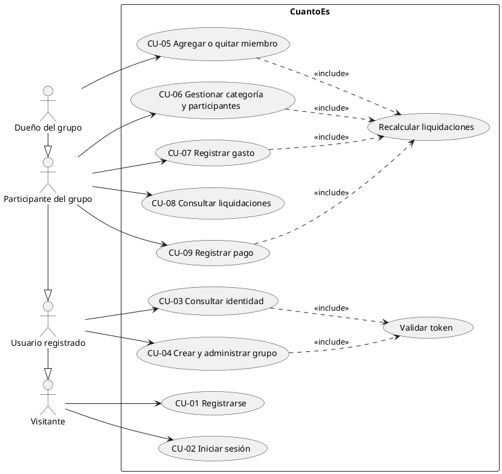

# Casos de uso de CuantoEs

- **CU-01 a CU-03 (Fase 1, autenticación)**: derivados de US1–US3 de
  `specs/001-backend-auth-base/spec.md`.
- **CU-04 a CU-09 (Fase 2, grupos, gastos y liquidaciones)**: derivados de US1–US5 de
  `specs/002-groups-expenses-settlements/spec.md`.

Es la base para la Plantilla 02 (13/10). Los IDs de los casos de prueba (CP-xx) están en
[plan-de-pruebas.md](plan-de-pruebas.md).

## Diagrama de casos de uso

- **Visitante**: cualquier persona sin sesión iniciada.
- **Usuario registrado**: persona con cuenta y un token vigente. Hereda los casos del Visitante.
- **Participante del grupo**: el dueño del grupo o un miembro con cuenta. Los invitados sin cuenta
  figuran en los gastos y las liquidaciones, pero no son actores porque no inician sesión.
- **Dueño del grupo**: quien creó el grupo. No necesita ser miembro para administrarlo.
- **Validar token** se incluye en todos los casos protegidos (desde CU-03). En el diagrama se
  muestra solo en CU-03 y CU-04 para no recargarlo.
- **Recalcular liquidaciones** se incluye en todo caso que cambia el reparto. Reutiliza el
  algoritmo de la app (`calculate()` y `Category.distribute()`).

---

## CU-01 Registrarse

| Campo | Contenido |
|---|---|
| **Actor principal** | Visitante |
| **Objetivo** | Crear una cuenta propia para usar CuantoEs. |
| **Precondiciones** | No hay. |
| **Postcondiciones (éxito)** | Existe una cuenta con el email normalizado y la contraseña guardada solo como hash. El visitante queda identificado: recibe un token de acceso. |
| **Postcondiciones (fracaso)** | No se crea ninguna cuenta. |
| **Requisitos** | FR-001 a FR-006, FR-012 a FR-014 |

**Flujo principal**

1. El visitante indica nombre, email y contraseña.
2. El sistema normaliza el email (sin espacios alrededor y en minúsculas).
3. El sistema valida los datos: nombre de 1 a 100 caracteres, email con formato válido y
   contraseña de al menos 8 caracteres y como máximo 72 bytes.
4. El sistema guarda la cuenta con la contraseña protegida por un hash irreversible.
5. El sistema devuelve los datos públicos del usuario (identificador, nombre, email) y un token
   de acceso válido por 7 días.

**Flujos alternativos**

- **3a. Datos inválidos**: el sistema rechaza el registro e indica, en castellano, qué campo es
  inválido y por qué. Fin del caso de uso.
- **3b. Solicitud vacía o mal formada**: el sistema la rechaza como datos inválidos, sin
  detalles técnicos. Fin del caso de uso.
- **4a. Email ya registrado** (con cualquier combinación de mayúsculas y espacios, incluso si
  dos registros llegan al mismo tiempo): el sistema rechaza el registro con el mensaje "Ese
  email ya está registrado". Fin del caso de uso.
- **4b. Base de datos no disponible**: el sistema informa que el servicio no está disponible,
  sin detalles internos, y no crea registros a medias. Fin del caso de uso.

**Reglas**: los campos que el cliente no puede fijar (identificador, hash, fechas) se ignoran.
La contraseña no se recorta ni se normaliza.

---

## CU-02 Iniciar sesión

| Campo | Contenido |
|---|---|
| **Actor principal** | Visitante (con cuenta) |
| **Objetivo** | Obtener un token para identificarse en las operaciones siguientes. |
| **Precondiciones** | No hay (si la cuenta no existe, se aplica 3a). |
| **Postcondiciones (éxito)** | El visitante recibe un token de acceso vigente por 7 días y sus datos públicos. |
| **Postcondiciones (fracaso)** | No se emite ningún token. |
| **Requisitos** | FR-007 a FR-009, FR-012, FR-013 |

**Flujo principal**

1. El visitante indica su email y su contraseña.
2. El sistema normaliza el email.
3. El sistema verifica que exista una cuenta con ese email y que la contraseña coincida.
4. El sistema devuelve un token de acceso firmado y los datos públicos del usuario.

**Flujos alternativos**

- **1a. Faltan datos o el email no tiene formato válido**: el sistema rechaza la solicitud como
  datos inválidos. Fin del caso de uso.
- **3a. Email inexistente o contraseña incorrecta**: el sistema responde "Email o contraseña
  incorrectos", con el mismo mensaje, el mismo tipo de error y un tiempo de respuesta similar en
  ambos casos, para no revelar qué emails tienen cuenta. Fin del caso de uso.
- **3b. Base de datos no disponible**: el sistema informa que el servicio no está disponible.
  Fin del caso de uso.

---

## CU-03 Consultar identidad

| Campo | Contenido |
|---|---|
| **Actor principal** | Usuario registrado |
| **Objetivo** | Comprobar con qué cuenta está identificado y que su token sigue siendo válido. |
| **Precondiciones** | El usuario tiene un token emitido por CU-01 o CU-02. |
| **Postcondiciones (éxito)** | El usuario recibe su identificador, nombre y email. |
| **Postcondiciones (fracaso)** | No se devuelve ningún dato de usuario. |
| **Requisitos** | FR-009 a FR-011 |

**Flujo principal**

1. El usuario presenta su token.
2. El sistema valida el token (*include* "Validar token"): firma correcta, no vencido y
   perteneciente a un usuario que sigue existiendo.
3. El sistema devuelve los datos públicos del usuario.

**Flujos alternativos**

- **1a. No se presenta token**: el sistema rechaza la solicitud como no autenticada
  ("Necesitás iniciar sesión"). Fin del caso de uso.
- **2a. Token alterado, vencido, firmado con otro secreto o de un usuario inexistente**: el
  sistema rechaza la solicitud como no autenticada. Fin del caso de uso.
- **2b. Base de datos no disponible**: el sistema informa que el servicio no está disponible.
  Fin del caso de uso.

---

## CU-04 Crear y administrar grupo

| Campo | Contenido |
|---|---|
| **Actor principal** | Usuario registrado (al crear) / Dueño del grupo (al renombrar o eliminar) |
| **Objetivo** | Tener un grupo (viaje, casa, evento) donde compartir gastos. |
| **Precondiciones** | Sesión iniciada. Para renombrar o eliminar: ser el dueño. |
| **Postcondiciones (éxito)** | El grupo existe con el usuario como dueño y aparece en su lista. Si se elimina, desaparecen el grupo y todo su contenido. |
| **Requisitos** | FR-001 a FR-007 |

**Flujo principal (crear)**

1. El usuario indica el nombre del grupo.
2. El sistema valida el nombre (1 a 100 caracteres, recortado).
3. El sistema crea el grupo con el usuario como dueño. El dueño no pasa a ser miembro.
4. El grupo aparece en la lista del usuario.

**Flujos alternativos**

- **2a. Nombre vacío o demasiado largo**: el sistema rechaza la solicitud indicando el campo.
- **A1. Consultar la lista**: el usuario ve los grupos de los que es dueño o miembro con cuenta,
  del más reciente al más antiguo.
- **A2. Renombrar o eliminar**: solo el dueño. Al eliminar, se borran miembros, categorías, gastos
  y liquidaciones. Un miembro que no es dueño recibe un rechazo por falta de permisos.
- **A3. Grupo ajeno**: un usuario que no es dueño ni miembro recibe "no encontrado", sin que se
  revele si el grupo existe.

---

## CU-05 Agregar o quitar miembro

| Campo | Contenido |
|---|---|
| **Actor principal** | Dueño del grupo |
| **Objetivo** | Sumar a quienes comparten los gastos, con o sin cuenta en CuantoEs. |
| **Precondiciones** | El actor es el dueño del grupo. |
| **Postcondiciones (éxito)** | La persona figura como miembro. Si tiene cuenta, ve el grupo en su lista. |
| **Requisitos** | FR-008 a FR-012 |

**Flujo principal (agregar)**

1. El dueño indica el email de una persona registrada, o un alias si es un invitado sin cuenta.
2. El sistema normaliza el email (o recorta el alias) y valida que se haya indicado solo uno.
3. El sistema agrega al miembro. Su nombre visible es el de la cuenta, o el alias.

**Flujos alternativos**

- **2a. Email y alias a la vez, o ninguno**: el sistema rechaza la solicitud.
- **3a. El email no corresponde a ninguna cuenta**: el sistema lo rechaza y sugiere agregarlo
  como invitado.
- **3b. La persona ya es miembro, o el alias ya existe entre los invitados** (sin distinguir
  mayúsculas): el sistema rechaza el duplicado.
- **A1. Cambiar el alias de un invitado**: solo para miembros sin cuenta.
- **A2. Quitar un miembro**: solo si no pagó gastos ni tiene pagos registrados. Deja de
  participar de sus categorías y se recalculan las liquidaciones (*include* Recalcular).
  Si pagó gastos o tiene pagos, el sistema lo rechaza indicando el motivo.
- **A3. Un miembro que no es dueño intenta gestionar miembros**: rechazo por falta de permisos.

---

## CU-06 Gestionar categoría y participantes

| Campo | Contenido |
|---|---|
| **Actor principal** | Participante del grupo |
| **Objetivo** | Agrupar gastos (Nafta, Supermercado) y definir entre quiénes se reparten. |
| **Precondiciones** | El actor es dueño o miembro con cuenta del grupo. |
| **Postcondiciones (éxito)** | La categoría existe con su lista de participantes. Las liquidaciones están recalculadas. |
| **Requisitos** | FR-003a, FR-013 a FR-015b |

**Flujo principal (crear)**

1. El participante indica el nombre y, opcionalmente, qué miembros participan.
2. El sistema valida el nombre y que los participantes sean miembros del grupo. Si no se
   indicaron, participan todos los miembros actuales.
3. El sistema crea la categoría registrando quién la creó, y recalcula (*include* Recalcular).

**Flujos alternativos**

- **2a. Nombre repetido en el grupo** (sin distinguir mayúsculas ni espacios): rechazo.
- **2b. Participantes vacíos, repetidos o de otro grupo**: rechazo indicando el campo.
- **A1. Renombrar o eliminar**: solo el dueño del grupo o quien creó la categoría. Al eliminarla
  se borran sus gastos y participantes, y se recalcula.
- **A2. Sumar un participante**: entra en el reparto aunque no haya pagado nada. Se recalcula.
- **A3. Quitar un participante**: se rechaza si pagó gastos en la categoría o si es el último.
- **A4. Otro participante sin permiso intenta modificarla**: rechazo por falta de permisos.

---

## CU-07 Registrar gasto

| Campo | Contenido |
|---|---|
| **Actor principal** | Participante del grupo |
| **Objetivo** | Cargar un pago individual para que entre en el reparto. |
| **Precondiciones** | Existe la categoría y quien pagó participa de ella. |
| **Postcondiciones (éxito)** | El gasto queda guardado con sus datos exactos y su autor. Las liquidaciones están recalculadas. |
| **Requisitos** | FR-003a, FR-016 a FR-020 |

**Flujo principal**

1. El participante indica quién pagó, el monto, la fecha y, opcionalmente, una descripción.
2. El sistema valida el monto (mayor que cero, con hasta 2 decimales y hasta
   9.999.999.999,99), la fecha (una fecha de calendario válida) y que quien pagó participe de la
   categoría.
3. El sistema guarda el gasto y recalcula las liquidaciones (*include* Recalcular).

**Flujos alternativos**

- **2a. Monto inválido o con más de 2 decimales**: rechazo (no se redondea).
- **2b. Quien pagó no participa de la categoría o es de otro grupo**: rechazo indicando el campo.
- **A1. Consultar los gastos de una categoría**: del más reciente al más antiguo.
- **A2. Modificar o eliminar un gasto**: solo el dueño del grupo o quien lo cargó. Se puede
  cambiar cualquier dato, incluso la categoría, y se vuelve a validar. Se recalcula.
- **A3. Otro participante intenta modificarlo**: rechazo por falta de permisos (sí puede verlo).

---

## CU-08 Consultar liquidaciones

| Campo | Contenido |
|---|---|
| **Actor principal** | Participante del grupo |
| **Objetivo** | Saber quién le debe a quién y cuánto. |
| **Precondiciones** | El actor es dueño o miembro con cuenta del grupo. |
| **Postcondiciones** | Ninguna: consultar no modifica nada. |
| **Requisitos** | FR-021 a FR-027b |

**Flujo principal**

1. El participante pide las liquidaciones del grupo.
2. El sistema devuelve:
   - las transferencias pendientes del último recálculo: mínimas, sin cadenas y con montos en
     centavos;
   - los pagos ya registrados;
   - el saldo de cada miembro: lo aportado, su parte, lo pagado y lo recibido, y lo que le falta.

**Flujos alternativos**

- **2a. Cuentas equilibradas o sin gastos**: no hay transferencias pendientes.
- **2b. Usuario sin acceso al grupo**: "no encontrado".

**Reglas del cálculo** (Recalcular liquidaciones):

- Es el mismo algoritmo que la app: reparto por categoría, unificación de pagos y eliminación
  de cadenas.
- La parte de cada participante es el promedio redondeado hacia abajo al centavo; los centavos
  sobrantes los absorbe quien más pagó.
- Los pagos ya realizados se descuentan.

---

## CU-09 Registrar pago

| Campo | Contenido |
|---|---|
| **Actor principal** | Participante del grupo que es deudor o acreedor de la liquidación, o el dueño |
| **Objetivo** | Dejar constancia de una transferencia hecha, total o parcial. |
| **Precondiciones** | La liquidación está pendiente y vigente (no fue reemplazada por un recálculo). |
| **Postcondiciones (éxito)** | Queda un pago registrado por el monto abonado, con fecha y autor. Lo que falta se recalcula como pendiente. |
| **Requisitos** | FR-027c, FR-028, FR-028a |

**Flujo principal**

1. El deudor, el acreedor o el dueño indica que la liquidación se pagó y, opcionalmente, el
   monto (por defecto, el total).
2. El sistema valida que el monto sea mayor que cero y no supere el de la liquidación.
3. El sistema registra el pago y recalcula las pendientes (*include* Recalcular).

**Flujos alternativos**

- **1a. La liquidación fue reemplazada por un recálculo**: el sistema pide volver a consultar
  las liquidaciones.
- **1b. Ya estaba pagada**: rechazo.
- **1c. Otro participante que no es parte de la deuda ni dueño**: rechazo por falta de permisos.
- **2a. Monto mayor que la liquidación, cero o con más de 2 decimales**: rechazo.
- **A1. Volver a pendiente**: el deudor, el acreedor o el dueño anula un pago registrado. El pago
  deja de contar y se recalcula.
