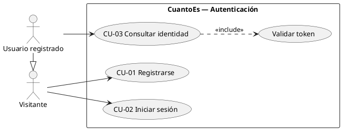

# Casos de uso: autenticación (Fase 1)

Derivados de las historias US1–US3 de `specs/001-backend-auth-base/spec.md`. Base para la
Plantilla 02 (13/10). Los IDs de los casos de prueba (CP-xx) están en
[plan-de-pruebas.md](plan-de-pruebas.md).

## Diagrama de casos de uso

- **Visitante**: cualquier persona sin sesión iniciada.
- **Usuario registrado**: persona con cuenta y un token vigente. Hereda los casos del Visitante.
- **Validar token** se incluye en CU-03 y lo reutilizarán todos los casos de uso protegidos de
  las fases siguientes (grupos, gastos, liquidaciones).

---

## CU-01 Registrarse

| Campo | Contenido |
|---|---|
| **Actor principal** | Visitante |
| **Objetivo** | Crear una cuenta propia para usar CuantoEs. |
| **Precondiciones** | No hay. |
| **Postcondiciones (éxito)** | Existe una cuenta con el email normalizado y la contraseña guardada solo como hash. El visitante queda identificado: recibe un token de acceso. |
| **Postcondiciones (fracaso)** | No se crea ninguna cuenta. |
| **Requisitos** | FR-001 a FR-006, FR-012 a FR-014 |

**Flujo principal**

1. El visitante indica nombre, email y contraseña.
2. El sistema normaliza el email (sin espacios alrededor y en minúsculas).
3. El sistema valida los datos: nombre de 1 a 100 caracteres, email con formato válido y
   contraseña de al menos 8 caracteres y como máximo 72 bytes.
4. El sistema guarda la cuenta con la contraseña protegida por un hash irreversible.
5. El sistema devuelve los datos públicos del usuario (identificador, nombre, email) y un token
   de acceso válido por 7 días.

**Flujos alternativos**

- **3a. Datos inválidos**: el sistema rechaza el registro e indica, en castellano, qué campo es
  inválido y por qué. Fin del caso de uso.
- **3b. Solicitud vacía o mal formada**: el sistema la rechaza como datos inválidos, sin
  detalles técnicos. Fin del caso de uso.
- **4a. Email ya registrado** (con cualquier combinación de mayúsculas y espacios, incluso si
  dos registros llegan al mismo tiempo): el sistema rechaza el registro con el mensaje "Ese
  email ya está registrado". Fin del caso de uso.
- **4b. Base de datos no disponible**: el sistema informa que el servicio no está disponible,
  sin detalles internos, y no crea registros a medias. Fin del caso de uso.

**Reglas**: los campos que el cliente no puede fijar (identificador, hash, fechas) se ignoran.
La contraseña no se recorta ni se normaliza.

---

## CU-02 Iniciar sesión

| Campo | Contenido |
|---|---|
| **Actor principal** | Visitante (con cuenta) |
| **Objetivo** | Obtener un token para identificarse en las operaciones siguientes. |
| **Precondiciones** | No hay (si la cuenta no existe, se aplica 3a). |
| **Postcondiciones (éxito)** | El visitante recibe un token de acceso vigente por 7 días y sus datos públicos. |
| **Postcondiciones (fracaso)** | No se emite ningún token. |
| **Requisitos** | FR-007 a FR-009, FR-012, FR-013 |

**Flujo principal**

1. El visitante indica su email y su contraseña.
2. El sistema normaliza el email.
3. El sistema verifica que exista una cuenta con ese email y que la contraseña coincida.
4. El sistema devuelve un token de acceso firmado y los datos públicos del usuario.

**Flujos alternativos**

- **1a. Faltan datos o el email no tiene formato válido**: el sistema rechaza la solicitud como
  datos inválidos. Fin del caso de uso.
- **3a. Email inexistente o contraseña incorrecta**: el sistema responde "Email o contraseña
  incorrectos", con el mismo mensaje, el mismo tipo de error y un tiempo de respuesta similar en
  ambos casos, para no revelar qué emails tienen cuenta. Fin del caso de uso.
- **3b. Base de datos no disponible**: el sistema informa que el servicio no está disponible.
  Fin del caso de uso.

---

## CU-03 Consultar identidad

| Campo | Contenido |
|---|---|
| **Actor principal** | Usuario registrado |
| **Objetivo** | Comprobar con qué cuenta está identificado y que su token sigue siendo válido. |
| **Precondiciones** | El usuario tiene un token emitido por CU-01 o CU-02. |
| **Postcondiciones (éxito)** | El usuario recibe su identificador, nombre y email. |
| **Postcondiciones (fracaso)** | No se devuelve ningún dato de usuario. |
| **Requisitos** | FR-009 a FR-011 |

**Flujo principal**

1. El usuario presenta su token.
2. El sistema valida el token (*include* "Validar token"): firma correcta, no vencido y
   perteneciente a un usuario que sigue existiendo.
3. El sistema devuelve los datos públicos del usuario.

**Flujos alternativos**

- **1a. No se presenta token**: el sistema rechaza la solicitud como no autenticada
  ("Necesitás iniciar sesión"). Fin del caso de uso.
- **2a. Token alterado, vencido, firmado con otro secreto o de un usuario inexistente**: el
  sistema rechaza la solicitud como no autenticada. Fin del caso de uso.
- **2b. Base de datos no disponible**: el sistema informa que el servicio no está disponible.
  Fin del caso de uso.
