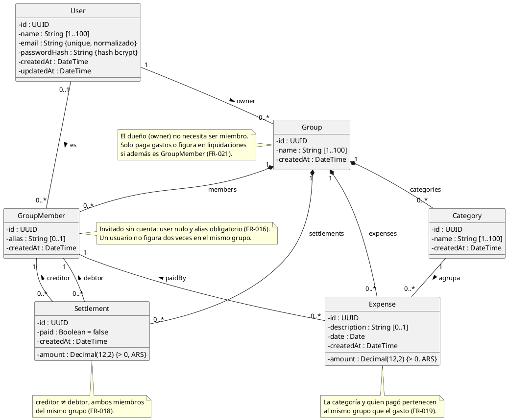

# Diagrama de clases (primer borrador)

Modelo de dominio persistido en la Fase 1, a partir de
`specs/001-backend-auth-base/data-model.md` y `server/prisma/schema.prisma`. Es la base del
diagrama de clases de la Plantilla 03 (04/12) y **no reemplaza al ERD**: en la Fase 2 se le
suman las operaciones (reparto con `calculate()` / `distribute()`) y las clases de dominio del
cliente (`Person`, `Category`, `Peer`).

## Reglas de integridad (FR-015 a FR-021)

| Regla | Dónde se garantiza |
|---|---|
| Un miembro sin cuenta tiene alias no vacío (FR-016) | `CHECK group_members_user_or_alias` |
| Un usuario no se repite en un grupo (FR-016) | `UNIQUE (group_id, user_id)` |
| Montos con 2 decimales exactos y mayores que cero (FR-017) | `DECIMAL(12,2)` + `CHECK amount > 0` |
| Acreedor ≠ deudor, del mismo grupo; `paid` por defecto `false` (FR-018) | `CHECK settlements_distinct_members` + FK compuestas |
| Categoría y pagador del mismo grupo que el gasto (FR-019) | FK compuestas `(category_id, group_id)` y `(paid_by_id, group_id)` |
| Nombre de categoría único en el grupo (FR-020) | `UNIQUE (group_id, name)` |
| Todo grupo tiene dueño, que no necesita ser miembro (FR-021) | `owner_id NOT NULL` |

## Correspondencia con el dominio del cliente

| Clase del cliente | Clase persistida |
|---|---|
| `Person` | `GroupMember` (+ `User` opcional) |
| `Category` | `Category` (el gasto agregado por persona pasa a ser la suma de sus `Expense`) |
| `Peer` | `Settlement` (más el estado `paid`) |
