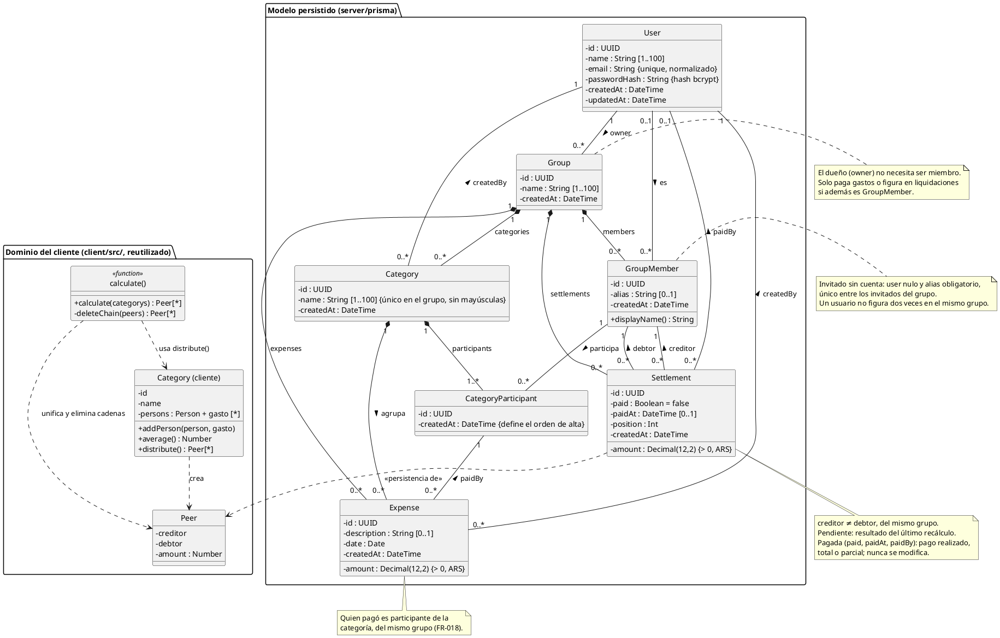
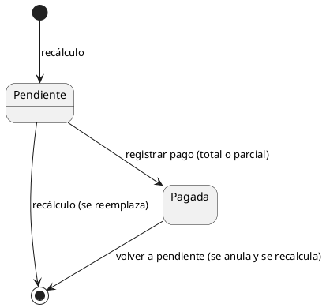

# Diagrama de clases

El diagrama se divide en dos paquetes:

- **Modelo persistido**: el de la Fase 1 más lo que suma la Fase 2 (participantes por categoría,
  autores de categorías y gastos, datos del pago). Fuentes: `specs/001-backend-auth-base/data-model.md`,
  `specs/002-groups-expenses-settlements/data-model.md` y `server/prisma/schema.prisma`.
- **Dominio del cliente**: las clases `Category`, `Peer` y la función `calculate()` de la app,
  que el servidor reutiliza sin cambios para calcular las liquidaciones.

Es la base del diagrama de clases de la Plantilla 03 (04/12) y **no reemplaza al ERD**.

## Estados de una liquidación

## Reglas de integridad

| Regla | Dónde se garantiza |
|---|---|
| Un miembro sin cuenta tiene alias no vacío | `CHECK group_members_user_or_alias` |
| Un usuario no se repite en un grupo | `UNIQUE (group_id, user_id)` |
| Alias de invitados únicos sin distinguir mayúsculas (FR-009 de la 002) | índice único parcial `group_members_group_alias_ci` |
| Montos con 2 decimales exactos y mayores que cero | `DECIMAL(12,2)` + `CHECK amount > 0` |
| Acreedor ≠ deudor, del mismo grupo; `paid` por defecto `false` | `CHECK settlements_distinct_members` + FK compuestas |
| Una liquidación pagada tiene fecha y autor del pago (FR-028 de la 002) | `CHECK settlements_paid_at_consistent` y `settlements_paid_by_consistent` |
| Categoría y pagador del mismo grupo que el gasto | FK compuestas `(category_id, group_id)` y `(paid_by_id, group_id)` |
| Quien pagó es participante de la categoría (FR-018 de la 002) | FK `(category_id, paid_by_id)` → `category_participants` |
| Nombre de categoría único en el grupo, sin distinguir mayúsculas | índice único `categories_group_name_ci` |
| Todo grupo tiene dueño, que no necesita ser miembro | `owner_id NOT NULL` |
| Borrar un grupo o una categoría borra su contenido; no se borra un miembro o participante con gastos | `ON DELETE CASCADE` / `NO ACTION` |

## Correspondencia con el dominio del cliente

| Clase del cliente | Clase persistida | Cómo se conecta en la Fase 2 |
|---|---|---|
| `Person` | `GroupMember` (+ `User` opcional) | el `id` del miembro es el `id` de la persona que recibe `distribute()` |
| `Category` | `Category` + `CategoryParticipant` | cada participante entra con lo que pagó (la suma de sus `Expense`) menos su parte |
| `Peer` | `Settlement` | cada `Peer` que devuelve `calculate()` se guarda como liquidación pendiente |
